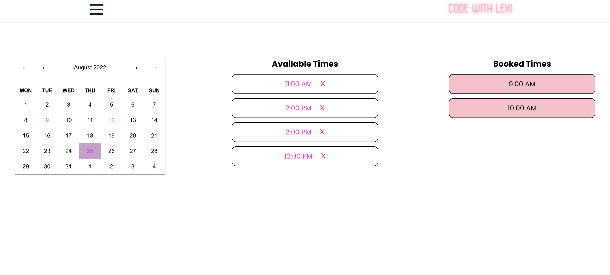

App Title: Code with Lexi: A tutoring website with integrated booking and payment funcionality. 

☐ Screenshot(s):  
      
      
      
      

☐ Technologies Used: 
<ul>
<li>MERN</li>
<li>Paypal REST API</li>
<li>react-calendar npm</li>
</ul>

☐ Getting Started:  
<ul>
<li> Deployed App: https://codewithlexi.herokuapp.com/ </li>
</ul>

☐ Next Steps:  
<ul>
<li> user dashboard where they can manage/delete/reschedule booked sessions </li>
</ul>